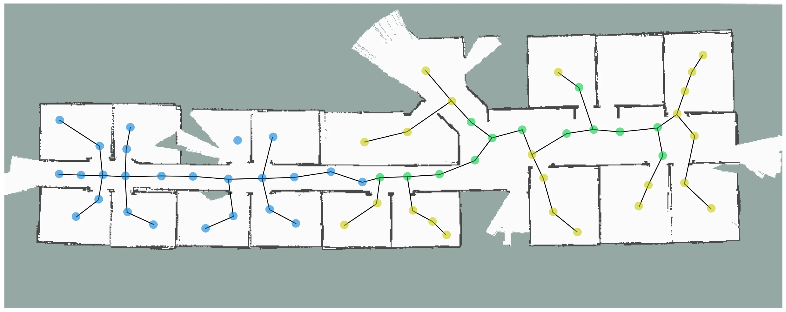
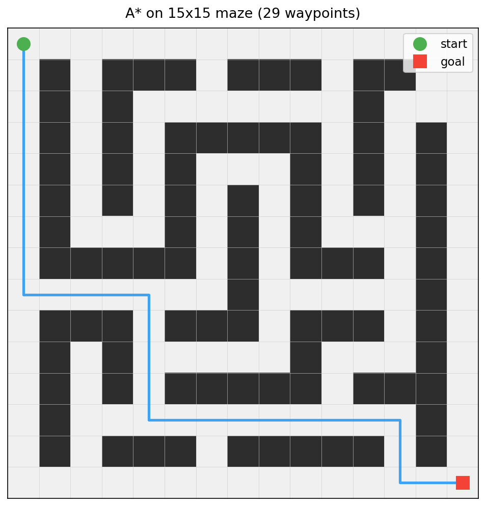
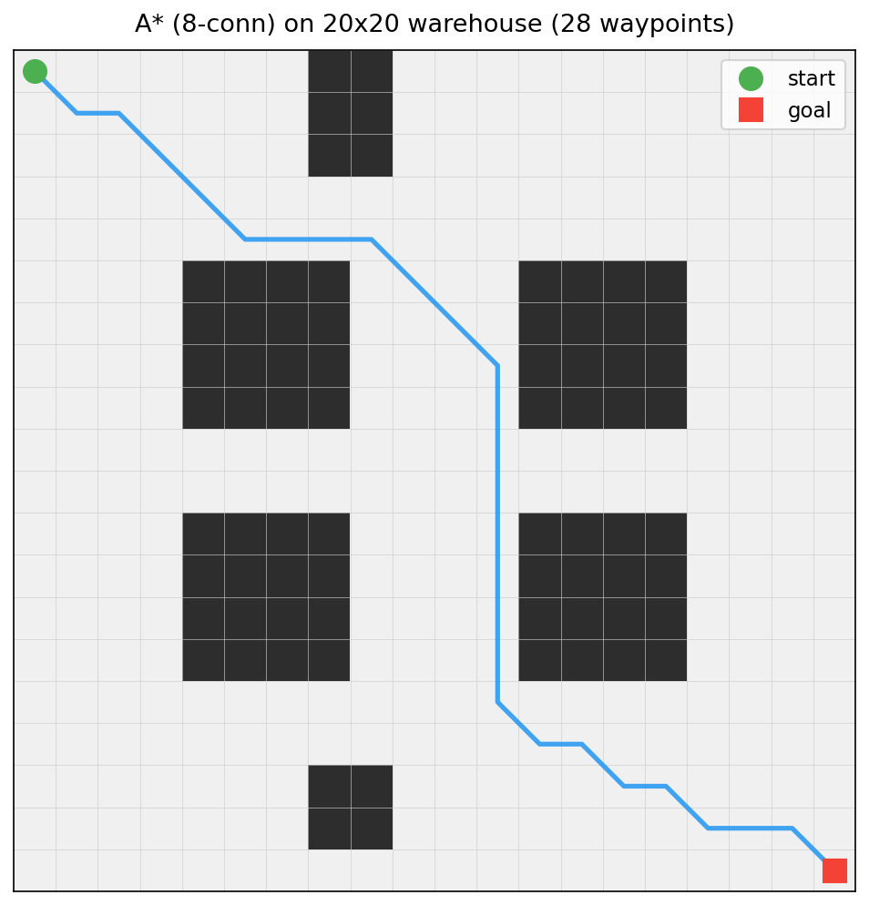

<p align="center">
  
</p>

## Project rationale

A robot needs to get from one end of a warehouse to the other, and the warehouse is full of shelves. This code finds the shortest collision-free path around those obstacles. Two methods, two different tradeoffs: A* searches the full grid and guarantees the optimal path. RRT samples the space randomly and finds a usable path faster, at the cost of optimality.

This is the single-agent motion planning layer. The [swarm coordinator](https://github.com/uzumakix/bio-mimetic-swarm) decides where agents should go; this library computes how they get there without colliding with walls or each other. Together they cover the two sides of autonomous navigation: task allocation and path execution.

## What the project finds

A* with 8-connectivity solves a 20x20 warehouse layout in 28 waypoints, routing around storage blocks with diagonal cuts. On a 15x15 maze with narrow corridors, 4-connected A* finds a 29-waypoint optimal path. RRT handles the same problems with fewer waypoints but higher total cost due to random sampling.

### Maze (A*, 4-connected)

<p align="center">
  
</p>

### Warehouse (A*, 8-connected)

<p align="center">
  
</p>

## Algorithms

### A*

Runs on the discrete grid with a hand-rolled binary heap that supports decrease-key. The standard `std::priority_queue` lacks this operation, which forces either lazy deletion (re-inserting nodes with updated costs) or a full re-heapify. Both waste time on large grids. The custom heap maintains a position map from grid indices to heap positions, so decrease-key runs in O(log n).

Supports 4-connected and 8-connected movement. When using 8-connectivity, diagonal moves check both adjacent cardinal neighbors to prevent corner-cutting through walls. A diagonal from (x,y) to (x+1,y+1) is only valid if both (x+1,y) and (x,y+1) are passable.

Heuristic is configurable between Manhattan (admissible for 4-connected) and Euclidean (admissible for both). Euclidean is the default since it remains admissible in either connectivity mode.

### RRT (Rapidly-exploring Random Tree)

Samples in continuous coordinates, snaps to the grid for collision checks. The tree nodes store floating-point positions to avoid discretization artifacts from rounding to cell centers during the sampling phase. Collision checks use Bresenham-style line traversal on the grid.

Goal bias defaults to 5%, meaning one in twenty samples is placed directly at the goal. This trades off exploration breadth against convergence speed. The step size and goal tolerance are configurable to handle different grid scales.

Nearest-neighbor lookup is brute-force O(n) per iteration. This is acceptable for grids up to ~1000x1000 but would need a k-d tree for larger spaces.

### Path smoothing

Iterative shortcutting: randomly select two non-adjacent waypoints, connect them with a straight line, and replace the intermediate path segment if the line is collision-free. Primarily useful for RRT output, which tends to produce paths with unnecessary zigzags due to the random sampling process. Default runs 200 shortcut attempts.

## Benchmarks

Performance on a 500x500 grid with vertical wall obstacles (gaps at alternating heights):

| Algorithm | Cost | Waypoints | Nodes/Iterations | Time |
|-----------|------|-----------|-------------------|------|
| A* (4-conn) | ~1980 | ~1980 | ~180k | ~45ms |
| A* (8-conn) | ~1520 | ~820 | ~85k | ~25ms |
| RRT | ~2200 | ~350 | ~40k tree nodes | ~120ms |

A* with 8-connectivity finds shorter paths (diagonal movement) while expanding fewer nodes. RRT produces paths with fewer waypoints but higher total cost due to suboptimal sampling. Smoothing typically removes 30-50% of RRT waypoints.

## How it works

**Grid representation.** The environment is a 2D occupancy grid stored as a flat vector of cell states (free, blocked, dynamic). Text files encode free cells as `.`, static obstacles as `#`, and dynamic obstacles as `D`. Dynamic obstacles are treated as blocked during planning but can be cleared at runtime for replanning.

**Planning pipeline.** The CLI accepts a grid file, start/goal coordinates, and algorithm choice. The planner runs A* or RRT, optionally applies path smoothing, and outputs the waypoint sequence. The visualization script reads this output and renders the grid with the path overlaid using matplotlib.

**Collision checking.** Both planners delegate collision queries to the grid. A* checks neighbors directly. RRT checks line segments using Bresenham traversal, sampling cells along the segment and rejecting any that are blocked.

## Project structure

```
src/
  grid.h / grid.cpp         2D occupancy grid with neighbor queries
  astar.h / astar.cpp       A* search with custom binary heap
  rrt.h / rrt.cpp           RRT planner with continuous sampling
  smoother.h / smoother.cpp iterative path shortcutting
  main.cpp                  CLI driver
tests/
  test_grid.cpp             grid loading, bounds, neighbors, costs
  test_astar.cpp            optimal paths, wall routing, heuristics
  test_rrt.cpp              open field, blocked, narrow passages
bench/
  bench_planner.cpp         500x500 grid comparison table
scenarios/
  maze.txt                  15x15 maze
  warehouse.txt             20x20 warehouse layout
scripts/
  visualize.py              matplotlib grid + path renderer
  generate_results.py       batch plot generation for scenarios
results/
  maze_astar.png            A* path through the maze
  warehouse_astar.png       A* path through the warehouse
```

## Build

```
mkdir build && cd build
cmake .. -DCMAKE_BUILD_TYPE=Release
make
```

Requires C++17. Tested with GCC 12+ and Clang 15+.

## Usage

```
./planner --grid <file> --start x,y --goal x,y --algo astar|rrt [--smooth] [--eight]
```

Pipe the output into the visualizer:

```
./planner --grid ../scenarios/maze.txt --start 0,0 --goal 14,14 --algo astar | \
    python3 ../scripts/visualize.py --grid ../scenarios/maze.txt
```

Run the benchmark suite:

```
./bench_planner
```

Run tests:

```
cd build && ctest --output-on-failure
```

## References

- Hart, P.E., Nilsson, N.J., Raphael, B. (1968). A formal basis for the heuristic determination of minimum cost paths. *IEEE Transactions on Systems Science and Cybernetics*, 4(2), 100-107.
- LaValle, S.M. (1998). Rapidly-exploring random trees: A new tool for path planning. *TR 98-11*, Computer Science Dept., Iowa State University.
- Geraerts, R., Overmars, M.H. (2007). Creating high-quality paths for motion planning. *International Journal of Robotics Research*, 26(8), 845-863.

## License

MIT
